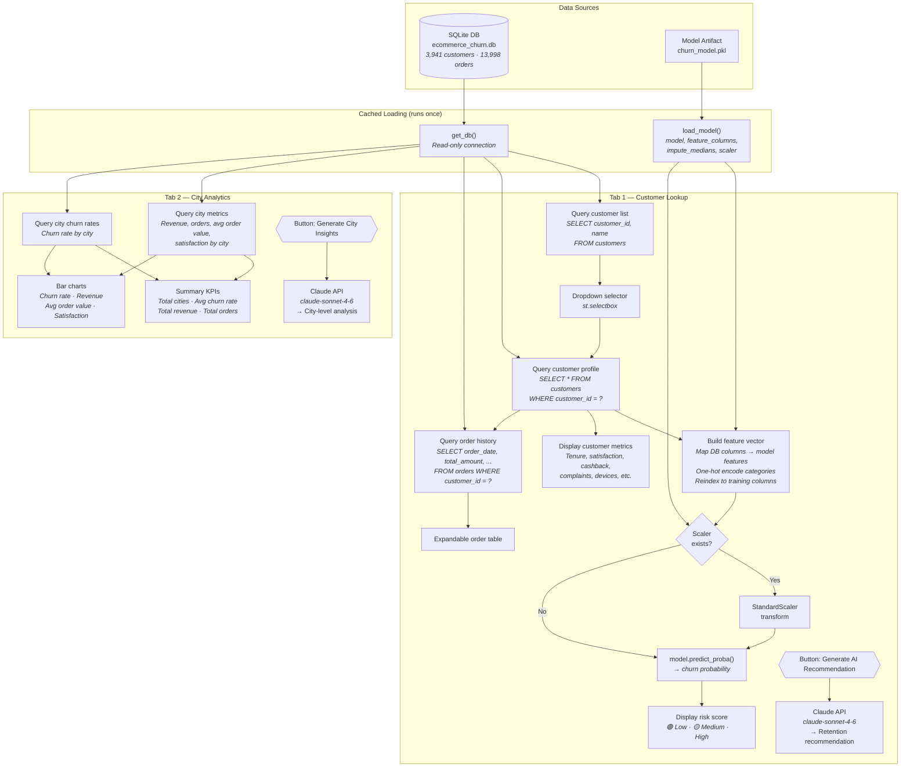

# Streamlit App Architecture

Paste the Mermaid diagram below into Claude web and ask it to visualize it.



## Text Description

```
┌─────────────────────────────────────────────────────────────────┐
│                        DATA SOURCES                             │
│  SQLite DB (ecommerce_churn.db)    Model Artifact (.pkl)        │
│  • customers table (3,941 rows)    • Random Forest model        │
│  • orders table (13,998 rows)      • feature_columns            │
│                                    • impute_medians             │
│                                    • StandardScaler             │
└──────────────┬──────────────────────────────┬───────────────────┘
               │                              │
               ▼                              ▼
┌──────────────────────┐       ┌──────────────────────────┐
│  get_db()            │       │  load_model()            │
│  Cached DB connection│       │  Cached model + scaler   │
│  (read-only mode)    │       │  + feature columns       │
└──────────┬───────────┘       └────────────┬─────────────┘
           │                                │
     ┌─────┴──────────────────┬─────────────┘
     ▼                        ▼
┌─────────────────────────────────────────────────────────────────┐
│  TAB 1: CUSTOMER LOOKUP                                         │
│                                                                 │
│  1. Query customer list → Dropdown selector                     │
│  2. Query selected customer profile                             │
│  3. Build feature vector:                                       │
│     • Map DB columns → model feature names                      │
│     • One-hot encode (PreferedOrderCat, MaritalStatus)          │
│     • Reindex to match training columns (fill_value=0)          │
│  4. Scale features (if scaler exists)                           │
│  5. model.predict_proba() → churn probability                   │
│  6. Display: risk score (color-coded), customer metrics          │
│  7. Query + display order history (expandable)                  │
│  8. [Button] → Claude API → AI retention recommendation         │
└─────────────────────────────────────────────────────────────────┘
┌─────────────────────────────────────────────────────────────────┐
│  TAB 2: CITY ANALYTICS                                          │
│                                                                 │
│  1. Query city-level metrics (revenue, orders, satisfaction)    │
│  2. Query city churn rates                                      │
│  3. Display: summary KPIs + bar charts (4 charts)               │
│  4. [Button] → Claude API → AI city insights                    │
└─────────────────────────────────────────────────────────────────┘
```
